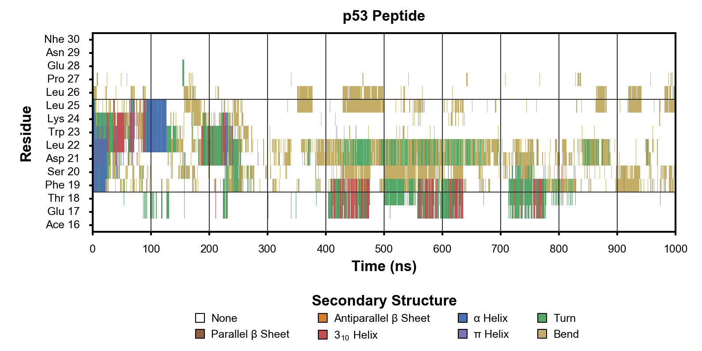

.. image:: https://travis-ci.org/KarlTDebiec/MolDynPlot.svg?branch=master
    :target: https://travis-ci.org/KarlTDebiec/MolDynPlot

.. image:: https://coveralls.io/repos/github/KarlTDebiec/MolDynPlot/badge.svg?branch=master
    :target: https://coveralls.io/github/KarlTDebiec/MolDynPlot?branch=master

Introduction
============

MolDynPlot is a Python package used to design matplotlib-based figures of
Molecular Dynamics (MD) simulation data using the simple text format YAML.

Example Outputs
===============

.. github_start

Time Series:

.. image:: doc/_static/p53/rmsd.png

2D Time Series:

.. github_end

.. only:: html

    Time Series:

    .. image:: _static/p53/rmsd.png
        :scale: 35
        :align: center

    2D Time Series:

    .. image:: _static/p53/dssp.png
        :scale: 35
        :align: center

Dependencies
------------

MolDynPlot supports Python 2.7 and 3.4, and requires the following
packages:

- h5py
- ipython
- matplotlib
- pandas
- pyyaml
- scikit-learn
- scipy

Installation
------------

Change to the ``MolDynPlot`` directory and run::

    python setup.py install

Authorship
----------

MolDynPlot is developed by Karl T. Debiec, a graduate student at the
University of Pittsburgh advised by Professors Lillian T. Chong and Angela M.
Gronenborn.

License
-------

Released under a 3-clause BSD license.
